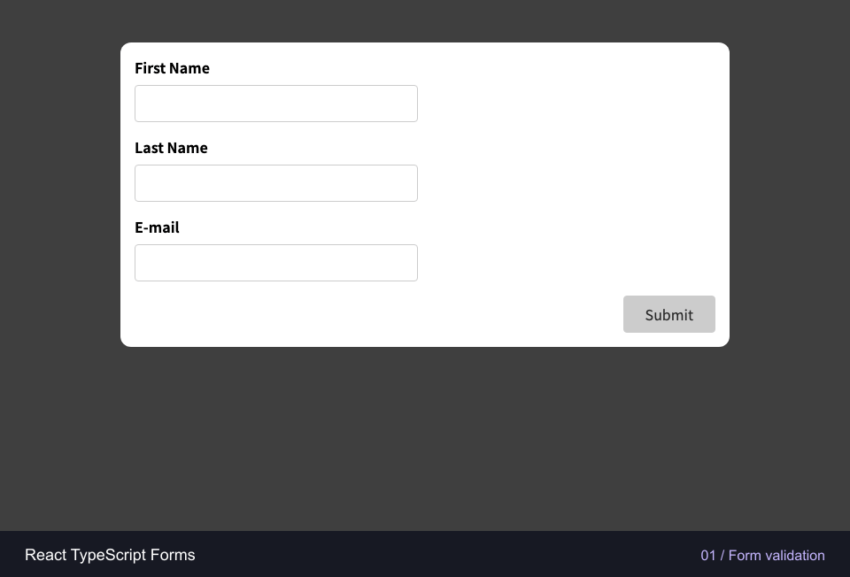

# Form Studio

**Thoughtful forms. A tidy people directory.**

Two React, TypeScript and Next.js applications demonstrating form validation and browser-based user management. Built with a shared UI package, keyboard-friendly interactions and production Docker images.

[](https://github.com/fatmakahveci/react-ts-forms/actions/workflows/test.yml)
[](apps/form-validation/package.json)
[](apps/form-validation/tsconfig.json)
[](LICENSE.md)

[Demo](#demo) · [Quick start](#quick-start) · [Development](#local-development) · [Quality checks](#quality-checks) · [Architecture](#architecture)

## Demo



The recording walks through both applications, from field validation to managing a small directory.

## What you can do

| Application          | Features                                                                                               | Local address with Docker               |
| -------------------- | ------------------------------------------------------------------------------------------------------ | --------------------------------------- |
| **Form validation**  | Validate names and email, follow completion progress, reset fields and receive a clear success message | [localhost:3000](http://localhost:3000) |
| **People directory** | Add and edit people, search and sort, delete with undo, and keep records across page reloads           | [localhost:3001](http://localhost:3001) |

- **Helpful feedback:** inline errors, focus on the first invalid field, visible keyboard focus and announced status messages.
- **Responsive interfaces:** layouts for desktop and small screens, with system fonts and no external font requests.
- **Resilient local storage:** duplicate-name checks, validation of saved records and fallback messaging when storage is unavailable.
- **Shared presentation:** one local UI package supplies the styles and icons used by both applications.

This is a learning and portfolio project. The directory stores data in your browser; it has no backend, authentication or cross-device synchronization.

## Quick start

Install and start Docker Desktop, or Docker Engine with Compose v2. Then:

```bash
git clone https://github.com/fatmakahveci/react-ts-forms.git
cd react-ts-forms
docker compose up --build -d --wait
```

Open [Form validation](http://localhost:3000) or [People directory](http://localhost:3001). No host Node.js installation is required. Both containers run production builds as non-root users, include health checks and bind their host ports to localhost.

```bash
# Inspect containers and follow logs
docker compose ps
docker compose logs -f

# Stop and remove the containers
docker compose down
```

To change ports or start one application:

```bash
FORM_VALIDATION_PORT=3100 USER_MANAGEMENT_PORT=3101 docker compose up --build -d --wait
docker compose up --build -d --wait form-validation
```

Run `docker compose up --build -d --wait` again after code changes. For hot reload, use the development servers below.

## Local development

Use **Node.js 22, version 22.12 or later**, and npm. Run these commands from the repository root:

```bash
npm ci
npm ci --prefix apps/form-validation
npm ci --prefix apps/user-management
```

Start each application in a separate terminal:

```bash
# Terminal 1 — http://localhost:3000
npm --prefix apps/form-validation run dev -- --port 3000

# Terminal 2 — http://localhost:3001
npm --prefix apps/user-management run dev -- --port 3001
```

If a port is already in use, stop the Docker containers or choose another `--port` value.

### Working on the shared UI

Both apps consume `packages/ui` as the local `@form-studio/ui` package. Their `.npmrc` files install a copy to keep builds self-contained. After changing shared styles or icons, refresh those copies and restart the development servers:

```bash
npm ci --prefix apps/form-validation
npm ci --prefix apps/user-management
```

Docker builds copy the current shared package automatically.

## Quality checks

After installing the root and application dependencies, run:

```bash
npm run format:check  # Prettier
npm test             # Vitest + React Testing Library
npm run lint         # Both apps and the shared UI component
npm run typecheck    # Next.js route types and TypeScript
npm run build        # Both production builds
```

Use `npm run format` to format files. The [CI workflow](.github/workflows/test.yml) runs all five checks on pushes and pull requests. Behavioral tests cover validation, reset, duplicate detection, editing, search, sorting, persistence, delete/undo and storage failures. [Dependabot](.github/dependabot.yml) checks npm dependencies and GitHub Actions weekly.

## Data and validation

| Rule             | Behavior                                                                                         |
| ---------------- | ------------------------------------------------------------------------------------------------ |
| Names            | 2–60 characters after trimming                                                                   |
| Email            | Requires a domain, such as `ada@example.com`; maximum 254 characters                             |
| Age              | Whole numbers from 12 to 120                                                                     |
| Duplicate people | Names are compared without case or surrounding spaces                                            |
| Directory size   | Up to 1,000 people                                                                               |
| Undo             | Restores the most recently deleted person; a successful add or edit clears that undo opportunity |

The validation form does not send or save submitted details. The directory uses the `form-studio.users.v1` key in `localStorage`. Records belong to the current browser and origin, so changing the host or port opens a separate directory. Tabs do not automatically synchronize.

If saved data is invalid, the original value is preserved and the session continues in memory. Storage write failures also keep the current session usable and show a warning. To reset the saved directory, remove that key through browser developer tools. Use sample data when trying the demo.

Client-side validation supports usability. Any backend added to these examples must validate input and enforce authorization separately.

## Architecture

```text
apps/
  form-validation/
    src/app/                 Next.js routes
    src/components/forms/    Validation form
    src/hooks/               Typed input-state hook
    src/shared/              Shared types
  user-management/
    src/app/                 Directory page and routes
    src/components/users/    Person form and list
    src/shared/              Types, validation and storage parsing
packages/ui/                 Shared CSS and icon component
tests/                       Behavioral regression tests
Dockerfile                   Shared multi-stage production build
compose.yaml                 Application services and local ports
```

Each application has its own package manifest and lockfile. Root scripts coordinate testing, linting and builds. Directories use kebab-case; React components use PascalCase filenames, and files without JSX use `.ts`.

## Contributing and security

See the [contributing guide](.github/CONTRIBUTING.md) for development and pull request expectations. Report vulnerabilities privately using the [security policy](.github/SECURITY.md).

Changes are recorded in the [changelog](CHANGELOG.md). Licensed under [Apache 2.0](LICENSE.md).
